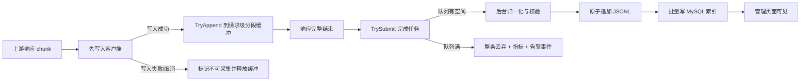

# 数据快照低延迟异步采集优化方案

## 1. 文档目的

本方案用于优化 HUICHUAN-AI 的数据快照采集链路。在完整保留已配置采集范围内数据的前提下，将用户 API 对话的首 Token、流式输出、完整响应时间以及高并发 P95/P99 延迟影响降到最低。

本方案基于以下已确认条件：

- 数据快照功能开启后，命中采集策略的成功请求应完整采集，不采用随机抽样降低负载。
- 极端情况下允许少量快照丢失，例如进程崩溃、断电、磁盘不足或后台队列满。
- 一旦发生丢失或持续异常，应第一时间向管理员发送邮件。
- 告警邮箱、采集范围和性能保护参数由 Root 在“系统设置 -> 数据快照”中配置。
- 用户对 API 响应速度最敏感，数据快照允许延迟出现在管理页面。
- 请求以流式调用为主，上下文大小不固定，可能包含长文本和多模态 Base64。
- 当前 MySQL、服务日志和数据快照可能位于同一块磁盘，需要避免同步 I/O 竞争。

## 2. 优化目标

### 2.1 核心目标

1. 上游响应数据必须先交付给客户端，再复制到数据快照缓冲区。
2. API 请求主链路不得执行 JSONL 写入、MySQL 索引写入、Schema 校验、完整协议归一化、HMAC 计算和大对象 JSON 序列化。
3. 每个请求只在完整成功并确认客户端交付完成后，向后台队列非阻塞投递一次完成任务。
4. 队列拥塞、磁盘异常和数据库异常不得反向阻塞用户 API。
5. 页面允许最终一致，后台完成 JSONL 和索引写入后再展示。

### 2.2 性能验收目标

以下指标需要通过同环境、同请求、同上游的 A/B 压测确认：

| 指标 | 目标 |
| --- | --- |
| 首 Token P95 增量 | 不超过 2 ms 或 2%，取更宽松值 |
| 流式 chunk 转发 P95 增量 | 不超过 1 ms |
| 完整响应 P95 增量 | 不超过 5 ms 或 2% |
| API 请求 goroutine 中的磁盘写入 | 0 次 |
| API 请求 goroutine 中的 MySQL 写入 | 0 次 |
| 队列正常时完整成功样本采集率 | 100% |
| JSONL 有效性 | 逐行 100% 可解析，禁止半行 |
| 队列满时 API 阻塞 | 0 ms，立即降级并记录丢弃 |
| 首次严重异常告警 | 发现后 60 秒内完成邮件投递尝试 |

性能目标不等于物理上的“绝对零开销”。完整采集必然产生一次数据复制和少量状态更新，但这些操作必须限定为内存操作，并位于客户端写入之后。

## 3. 当前实现的主要问题

当前关键链路位于：

- `middleware/dataset_capture.go`
- `pkg/datasetcapture/writer.go`
- `pkg/datasetcapture/normalize.go`
- `pkg/datasetcapture/response.go`
- `model/dataset_capture_index.go`

已观察到的性能风险：

1. `datasetResponseWriter.Write` 和 `WriteString` 当前先写临时 spool 文件，再写客户端。流式响应的每个 chunk 都可能先等待磁盘 I/O，直接增加流式输出延迟。
2. 每个命中策略的请求都会立即创建临时文件，即使响应很小，也会产生文件创建、权限修改、写入、Seek、读取和删除操作。
3. 请求结束后仍在请求 goroutine 中读取完整 spool、构建标准记录、执行协议解析、Schema 校验和提交。
4. `Writer.Submit` 当前在调用方执行完整 `Validate(record)`，大样本校验仍占用请求 goroutine。
5. `Writer.OnWritten` 当前逐条调用 `UpsertDatasetCaptureIndex`，JSONL 和 MySQL 索引写入串行，数据库抖动会降低后台消费速度并放大队列压力。
6. `directorySize` 在写入循环中可能遍历整个数据快照目录。文件增长后，该操作会持续变慢并增加同盘 I/O。
7. 队列默认仅 128 条，缺少按字节限制、队列水位、丢弃原因和告警聚合机制。
8. 请求体通过 `append([]byte(nil), body...)` 进行完整复制，长上下文或多模态请求可能带来明显内存带宽和 GC 压力。

## 4. 最终架构

采用“响应优先的请求级缓冲 + 完成任务队列 + 后台持久化流水线”。



该架构比“响应结束后再开始采集”更准确。请求和响应数据需要在传输过程中旁路复制，否则响应结束后可能已经无法重新获得流式内容；但旁路复制必须在客户端写入成功之后进行，并且不得在传输过程中做持久化和复杂计算。

## 5. 主链路设计

### 5.1 策略判断

请求入口只执行低成本判断：

1. 全局开关是否开启。
2. 路径是否属于支持协议。
3. 模型、用户和令牌是否命中采集范围。
4. 是否允许采集流式请求和多模态 Base64。

策略使用不可变快照和 `atomic.Value` 发布。请求只读取内存，不访问 MySQL，不读取配置文件。

### 5.2 请求数据处理

- 优先复用网关已经读取和保存的请求体，不重复读取网络流。
- 为请求体存储增加明确的只读生命周期或引用计数，完成任务接管后再释放。
- 无法保证底层缓冲区生命周期时，才执行一次分段复制。
- 禁止在请求入口执行归一化、HMAC、Schema 校验和 JSON marshal。
- 系统消息、工具、多模态等协议转换全部由后台 worker 完成。

### 5.3 流式响应处理顺序

流式响应必须保持以下顺序：

```go
n, err := w.ResponseWriter.Write(data)
if n > 0 {
    capture.TryAppend(data[:n])
}
if err != nil {
    capture.MarkDeliveryFailed(err)
}
return n, err
```

约束：

- `TryAppend` 只能执行内存复制和计数器更新。
- 不允许在 `Write` 或 `WriteString` 中访问磁盘、数据库或发送邮件。
- `Flush` 必须直接透传，数据快照逻辑不得延迟 SSE flush。
- 客户端写失败、取消或响应不完整时，整条快照作废。
- 若请求级缓冲超过限制，应标记当前快照丢弃，后续 chunk 仅透传，不再复制。

### 5.4 完成任务投递

响应满足以下条件后才能形成 `CaptureTask`：

- 最终成功 attempt 已确定。
- HTTP 状态为 2xx。
- 流式响应完整结束。
- 客户端响应未报告写入失败。
- 请求级缓冲没有超限或损坏。

投递使用非阻塞 `TrySubmit`：

```go
select {
case queue <- task:
    metrics.Submitted.Add(1)
default:
    task.Release()
    metrics.DroppedQueueFull.Add(1)
    alerts.Notify(QueueFull)
}
```

请求 goroutine 不等待 worker，不等待邮件，不重试投递。

## 6. 内存与大样本策略

### 6.1 分段缓冲

使用固定大小分段缓冲，建议每段 32 KiB 或 64 KiB，并通过 `sync.Pool` 复用。避免响应每增加一个 chunk 就扩容并复制整个 `bytes.Buffer`。

每条请求维护：

- 请求数据引用或分段副本。
- 响应分段列表。
- 当前字节数。
- 协议、模型、用户、令牌、渠道和会话元数据。
- 完整性、交付状态和丢弃原因。

### 6.2 双重容量保护

同时限制：

1. 单条快照最大字节数。
2. 全局在途快照最大字节数。

达到任一上限时，立即放弃当前快照并释放已占用内存，不阻塞 API。不能仅限制队列条数，因为 1000 条小请求和 1000 条多模态请求的内存占用完全不同。

### 6.3 spool 的使用边界

为了保证对用户速度影响最小，API 请求主链路不再实时写 spool。

- 正常响应在内存中完成旁路复制。
- 完成任务进入后台后，worker 可以把超出后台内存阈值的数据转为权限 `0600` 的 spool。
- 若全局内存水位过高，直接丢弃新快照，而不是让请求 goroutine同步写磁盘。
- 后台 spool 创建或写入失败时，整条快照丢弃并触发告警。

该选择利用了“允许极端情况下少量丢失”的条件，换取主 API 链路不受磁盘速度影响。

## 7. 后台持久化流水线

### 7.1 Worker 阶段

后台任务按以下顺序执行：

1. 解析最终成功的上游请求和响应。
2. 归一化 OpenAI Chat/Responses、Anthropic Messages 和 Gemini generateContent。
3. 生成稳定 `session_id` 和可选 HMAC。
4. 校验固定 11 个顶层字段及嵌套 Schema。
5. 一次性 JSON marshal。
6. 检查磁盘配额和最小剩余空间。
7. 在对应用户、令牌、会话 JSONL 中原子追加完整一行。
8. 将索引事件发送到独立批量索引队列。
9. 释放请求和响应缓冲区。

任何阶段失败都不得写入半条 JSONL。

### 7.2 JSONL 写入

- 每个节点继续使用独立目录。
- 每个用户、令牌和会话继续使用独立 JSONL 文件。
- 单条记录先完成序列化，再持有文件锁进行一次完整追加。
- 不对每条记录执行 `fsync`，由操作系统页缓存合并写入；如果未来需要强持久性，可增加可配置的周期性同步。
- 不在每次写入时遍历目录计算总大小。
- 维护进程内磁盘使用计数，定时后台校准目录大小和剩余空间。
- 启动时继续验证尾行，损坏尾部移入 `.corrupt-*` 后恢复。

### 7.3 MySQL 索引批量写入

JSONL 写成功后，索引事件进入独立队列，按以下任一条件批量提交：

- 累积 50 条。
- 距离上次提交达到 1 秒。

建议使用数据库方言对应的批量 upsert。索引写入失败时：

- JSONL 原始数据保留。
- 指数退避重试有限次数。
- 超过重试次数后记录待修复状态并告警。
- 提供后台重建索引任务，从 JSONL 恢复缺失索引。

页面查询只访问 `dataset_capture_indices`，不得为列表和筛选扫描 JSONL。仅查看详情、导出和删除时按索引定位文件和行。

## 8. 背压和降级策略

优先级固定为：

```text
用户 API 响应 > 网关核心业务 > 数据快照完整率 > 数据快照实时性
```

| 异常 | API 行为 | 数据快照行为 | 告警 |
| --- | --- | --- | --- |
| 完成任务队列满 | 正常响应 | 丢弃当前整条快照 | 立即首报，后续聚合 |
| 全局在途字节超限 | 正常响应 | 丢弃当前整条快照 | 立即首报，后续聚合 |
| 单条快照超限 | 正常响应 | 丢弃当前整条快照 | 按阈值聚合 |
| 磁盘剩余空间不足 | 正常响应 | 暂停持久化并丢弃新任务 | 立即告警 |
| JSONL 写入失败 | 正常响应 | 当前样本失败 | 立即告警 |
| MySQL 索引失败 | 正常响应 | 保留 JSONL，延迟展示 | 立即告警并重试 |
| 告警邮件失败 | 正常响应 | 不影响采集 | 写系统日志并计数 |
| 客户端取消或写失败 | 按原逻辑结束 | 不保存该样本 | 默认不发邮件 |
| 上游失败或重试失败 | 按原逻辑结束 | 不保存失败 attempt | 默认不发邮件 |

所有丢弃都是整条丢弃，禁止写入截断 JSONL 或不完整训练样本。

## 9. 邮件告警设计

### 9.1 告警原则

- 第一次检测到严重异常时立即投递邮件任务。
- 相同类型告警在静默窗口内不重复发送，只累计次数和影响数据量。
- 静默窗口结束且问题仍存在时发送汇总邮件。
- 恢复后发送一次恢复通知，包含异常持续时间、丢弃数量和最后错误。
- 邮件发送必须使用独立队列和 worker，不得占用 API 或数据快照持久化 worker。

### 9.2 邮件内容

邮件应包含：

- 节点名、环境和服务版本。
- 异常类型与首次发生时间。
- 最近一次发生时间。
- 静默窗口内发生次数。
- 丢弃快照数量和估算字节数。
- 当前队列深度、在途字节、磁盘剩余空间。
- 脱敏后的最近错误。
- 建议处理动作。

邮件不得包含提示词、响应正文、工具参数、API Key、Cookie 或完整令牌内容。

### 9.3 告警类型

- `queue_full`
- `inflight_bytes_exceeded`
- `sample_too_large`
- `disk_low`
- `disk_limit_reached`
- `jsonl_write_failed`
- `index_write_failed`
- `spool_write_failed`
- `worker_panic`
- `capture_recovered`

## 10. 系统设置设计

在“系统设置 -> 数据快照”中拆分为四个区域。

### 10.1 采集策略

- 是否开启数据快照。
- 模型范围：全部模型 / 指定模型。
- 用户范围：全部用户 / 指定用户。
- 令牌范围：全部令牌 / 指定令牌。
- 是否采集流式请求。
- 是否保留多模态 Base64。

范围内请求全部采集，不提供随机采样率。

### 10.2 性能保护

- 后台完成任务队列大小。
- 后台 worker 数量。
- 单条快照最大大小。
- 全局在途快照最大大小。
- 后台 spool 阈值。
- 最大磁盘占用。
- 最小剩余磁盘空间。
- MySQL 索引批量大小和刷新间隔。
- 导出任务并发数和读取限速。

修改后通过不可变配置快照热更新。影响队列容量或 worker 数量的配置可采用平滑重建，不能中断正在处理的任务。

### 10.3 异常邮件

- 是否开启数据快照异常邮件。
- 管理员收件邮箱，支持多个地址。
- 队列满告警。
- 磁盘空间不足告警。
- JSONL 写入失败告警。
- MySQL 索引写入失败告警。
- 单条样本过大告警。
- 连续丢弃 N 条后告警。
- 告警静默时间。
- 恢复通知开关。
- 发送测试邮件按钮。

优先复用系统现有 SMTP 配置，仅在数据快照页面配置收件人和告警策略，避免重复保存 SMTP 密钥。

### 10.4 运行状态

- 当前开关和策略版本。
- 完成任务队列深度、容量和使用率。
- 当前在途快照字节数。
- 最近 1 分钟、5 分钟提交量和写入量。
- 最近 1 分钟、5 分钟丢弃量及原因。
- JSONL P50/P95 写入耗时。
- MySQL 索引 P50/P95 批量耗时。
- 当前磁盘使用量和剩余空间。
- 最近一次异常、告警和恢复时间。

运行状态来自内存指标和定时采样，页面刷新不得扫描数据目录。

## 11. 推荐默认配置

```env
DATASET_CAPTURE_QUEUE_SIZE=1024
DATASET_CAPTURE_WORKERS=2
DATASET_CAPTURE_BUFFER_SEGMENT_KB=64
DATASET_CAPTURE_MAX_SAMPLE_MB=100
DATASET_CAPTURE_MAX_INFLIGHT_MB=512
DATASET_CAPTURE_SPOOL_THRESHOLD_MB=2
DATASET_CAPTURE_INDEX_QUEUE_SIZE=2048
DATASET_CAPTURE_INDEX_BATCH_SIZE=50
DATASET_CAPTURE_INDEX_FLUSH_INTERVAL_MS=1000
DATASET_CAPTURE_MIN_FREE_DISK_GB=2
DATASET_CAPTURE_MAX_DISK_GB=10
DATASET_CAPTURE_ALERT_SILENCE_MINUTES=10
DATASET_CAPTURE_ALERT_AFTER_DROPS=1
DATASET_CAPTURE_EXPORT_CONCURRENCY=1
DATASET_CAPTURE_EXPORT_READ_MBPS=32
DATASET_CAPTURE_SHUTDOWN_TIMEOUT_SECONDS=30
```

说明：

- 生产环境参数应根据内存、峰值并发、平均响应大小和磁盘性能调整。
- worker 不宜默认设置过多。同盘环境中并发写入过高会增加 I/O 抖动。
- `MAX_INFLIGHT_MB` 必须作为硬限制，防止上游变慢或磁盘拥塞导致内存失控。
- `EXPORT_READ_MBPS` 只限制后台导出生成速度，设置为 `0` 时不限制。
- 首次丢弃立即告警，后续由 10 分钟静默窗口聚合。

## 12. 代码改造范围

### 12.1 后端核心

| 文件或目录 | 改造内容 |
| --- | --- |
| `middleware/dataset_capture.go` | 去除请求主链路 spool；调整为先写客户端再旁路复制；响应完成后只投递任务 |
| `pkg/datasetcapture/context.go` | 增加请求级状态、所有权、完整性和释放逻辑 |
| `pkg/datasetcapture/writer.go` | 拆分任务队列、归一化 worker、JSONL writer 和索引队列；移除 Submit 同步校验 |
| `pkg/datasetcapture/buffer.go` | 新增分段缓冲、`sync.Pool`、单条和全局字节限制 |
| `pkg/datasetcapture/metrics.go` | 新增队列、字节、耗时、成功和丢弃指标 |
| `pkg/datasetcapture/alerts.go` | 新增告警事件、聚合、静默和恢复状态机 |
| `model/dataset_capture_index.go` | 增加批量 upsert 和索引重建能力 |
| `setting/dataset_capture_setting` | 扩展采集范围、性能保护和告警配置，继续使用原子快照 |
| `controller/dataset_capture_policy.go` | 扩展配置读写、校验和操作审计 |
| `controller/dataset_capture_status.go` | 新增运行状态和测试邮件接口 |

### 12.2 前端

| 文件或目录 | 改造内容 |
| --- | --- |
| `web/default/src/features/system-settings/maintenance/dataset-capture-settings-section.tsx` | 按采集策略、性能保护、异常邮件、运行状态重构设置页 |
| `web/default/src/features/system-settings/api.ts` | 增加策略、状态和测试邮件 API |
| `web/default/src/features/system-settings/types.ts` | 增加完整配置及状态类型 |
| `web/default/src/i18n/locales/*.json` | 同步所有语言文案 |

### 12.3 配置和数据库

建议继续通过 `options` 保存策略，不将 SMTP 密钥重复写入数据快照配置。新增配置项建议使用单个版本化 JSON 配置对象，避免大量松散 option key 难以原子更新。

建议的数据结构：

```json
{
  "version": 2,
  "enabled": true,
  "scope": {
    "model_mode": "selected",
    "models": [],
    "user_mode": "all",
    "user_ids": [],
    "token_mode": "all",
    "token_ids": [],
    "capture_stream": true,
    "preserve_multimodal_base64": true
  },
  "performance": {
    "queue_size": 1024,
    "workers": 2,
    "max_sample_mb": 100,
    "max_inflight_mb": 512,
    "spool_threshold_mb": 2,
    "max_disk_gb": 10,
    "min_free_disk_gb": 2,
    "index_batch_size": 50,
    "index_flush_interval_ms": 1000
  },
  "alerts": {
    "enabled": true,
    "recipients": [],
    "silence_minutes": 10,
    "alert_after_drops": 1,
    "send_recovery": true
  }
}
```

## 13. 分阶段实施

### P0：移除用户链路同步 I/O

1. 调整流式写入顺序为客户端优先。
2. 删除请求期间响应 spool 写入。
3. 增加请求级分段内存缓冲。
4. `BuildRecord`、`Validate`、HMAC 和 JSON marshal 全部移入 worker。
5. 完成时只执行一次非阻塞任务投递。
6. 增加队列满和内存超限计数。

这是最直接降低用户 API 延迟的一期，必须优先完成。

### P1：后台写入和索引解耦

1. 将归一化、JSONL 写入、MySQL 索引拆成流水线。
2. 索引改为批量 upsert。
3. 磁盘占用改为内存计数加定时校准。
4. 增加索引重建任务。
5. 对导出增加并发和 I/O 限制。

### P2：告警和运行状态

1. 增加独立告警聚合器和邮件 worker。
2. 复用现有 SMTP 配置。
3. 增加数据快照告警设置和测试邮件。
4. 增加队列、丢弃、磁盘、写入延迟运行状态。
5. 所有策略变更继续写入访问审计。

### P3：进程级隔离，可选

当单机并发和数据量继续增长时，可将归一化、JSONL 和索引写入迁移到同机独立 Capture Agent。主服务通过有界本地 IPC 队列传递完成任务，Agent 崩溃不影响 API 网关。

该阶段不是首选起点。现阶段先消除同步磁盘 I/O 和请求内归一化，收益最大且改造风险更低。

## 14. 测试方案

### 14.1 功能测试

- OpenAI Chat/Responses、Anthropic Messages、Gemini 流式和非流式完整采集。
- 文本、工具调用、工具结果、多轮消息和多模态 Base64。
- 最终成功重试仅保留成功 attempt。
- 客户端取消、写失败、非 2xx、半截 SSE 不保存。
- 固定 11 个顶层字段和所有嵌套字段不变。
- 用户、令牌、模型范围热更新正确生效。
- JSONL 写成功但索引失败后可重建索引。

### 14.2 并发与可靠性测试

- `go test -race` 验证缓冲池、队列关闭、配置热更新和 writer 并发安全。
- 队列满时请求不阻塞，且丢弃数准确。
- 全局在途字节超限时及时释放内存。
- worker panic 可恢复并告警。
- 磁盘满、只读目录、MySQL 断连、SMTP 失败故障注入。
- 进程退出时执行有超时的优雅排空，超过超时允许少量丢失。
- 启动恢复损坏尾行，不生成无效 JSONL。

### 14.3 性能测试

至少对比三组：

1. 数据快照关闭。
2. 当前实现开启。
3. 优化后实现开启。

请求集合应包含：

- 小文本流式响应。
- 32K、128K 长上下文。
- 大工具调用参数。
- 10 MB、50 MB 多模态请求。
- 高并发短请求。
- 慢客户端和客户端中途取消。

记录首 Token、chunk 间隔、完整耗时、CPU、RSS、GC、磁盘 IOPS、MySQL 延迟、队列水位和丢弃数。只有满足第 2.2 节指标后才能默认提供该优化实现。

### 14.4 建议验证命令

```powershell
go test ./pkg/datasetcapture ./middleware ./model ./controller ./router -count=1
go test -race ./pkg/datasetcapture ./middleware -count=1
go vet ./pkg/datasetcapture ./middleware ./model ./controller ./router
go test ./... -count=1
go vet ./...

Set-Location web/default
bun run i18n:sync
bun run build
```

另需增加一个本地可重复的 SSE 压测脚本，输出启用和关闭数据快照时的延迟差异及资源占用。

## 15. 发布与回滚

1. 新实现先通过独立功能开关灰度，保留原数据格式和读取接口。
2. 先在低流量节点启用，观察 24 小时队列、内存、磁盘、写入失败和告警。
3. 再扩大到全部节点，并按真实峰值调整队列和在途字节上限。
4. 回滚时只关闭新采集 worker，不影响 API 网关和已有 JSONL 数据。
5. 配置升级必须兼容旧的 `DatasetCaptureEnabled`、`DatasetCaptureModelMode` 和 `DatasetCaptureModels`，首次读取后迁移到版本化配置。

## 16. 最终结论

最佳方案不是等用户响应结束后才开始获取数据，而是：

1. 请求和响应传输期间只做低成本内存旁路复制。
2. 每个流式 chunk 永远先写客户端，复制失败也不能拖慢客户端。
3. 完整成功后只投递一次完成任务。
4. 归一化、校验、HMAC、JSONL、MySQL 和邮件全部在独立后台链路处理。
5. 通过队列条数、在途字节、磁盘空间和 worker 并发形成硬保护。
6. 极端拥塞时允许整条丢弃，并立即触发聚合邮件告警。

这套设计在不主动减少采集范围的前提下，将数据快照对用户 API 对话速度的影响压缩到一次受控的内存复制和少量原子计数，同时保证故障不会反向拖慢网关主业务。
